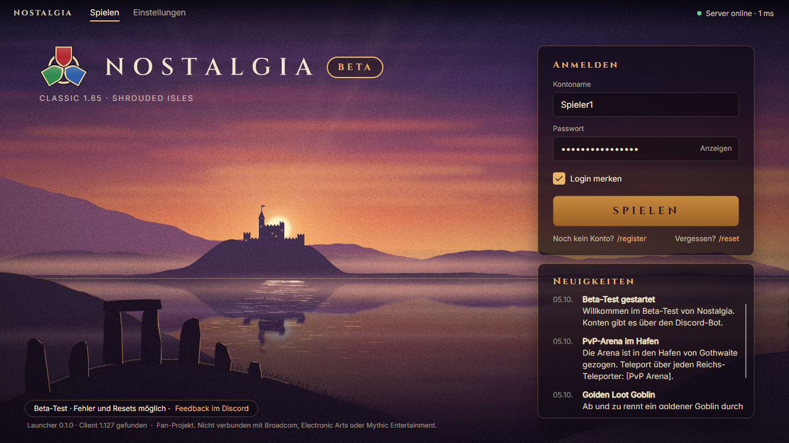

# Nostalgia Launcher

Windows launcher for **Nostalgia**, a PvP freeshard (classic 1.65 rules on the Dark Age of Camelot 1.127 client) – currently in **beta test**. It finds an existing client installation, logs the player in with the account from the Nostalgia Discord bot, shows server status and news, and updates itself.

> Nostalgia is a fan-run project and is not affiliated with or endorsed by Broadcom, Electronic Arts or Mythic Entertainment. Dark Age of Camelot is a trademark of its respective owner.

Player guide (German): [LIESMICH.md](LIESMICH.md).



## What it does – and doesn't

- Uses an **existing** client installation (game.dll **1.127** + `connect.exe`, e.g. from the OpenDAoC client installer). It never bundles, downloads or changes client files.
- Starts the client by command line only: `connect.exe "<game dll>" <host>:<port> <account> <password>` from the client folder, exactly like the OpenDAoC launcher does. Note: command-line arguments are visible to other processes of the same user.
- Never creates accounts and never talks to Discord's API: accounts come from the Discord bot (`/register`, `/reset`). The launcher stores account name + password encrypted with Windows DPAPI.
- Reads a remote manifest ([docs/manifest.md](docs/manifest.md)) for server address, links, news, launcher updates and the beta notice – so a server move or the end of the beta needs no new launcher.
- **Quickbars on Play:** when a player picks a spec preset at the Master Trainer, the server stores a quickbar layout for that character. On Play the launcher asks the server (`POST <quickbarUrl>/quickbar/pending` with the account login, HTTPS, 5 s timeout), writes bars 1–3 of each pending character into the client's character INI (`%APPDATA%\Electronic Arts\Dark Age of Camelot\<settings>\<Name>-5.ini`; all ten banks of each bar are replaced, everything else in the file stays byte for byte) and confirms the written ones (`/quickbar/ack`); then it starts the game. Server problems never block Play (a short notice instead); with layouts pending and a client running it refuses and asks to close the game first. Switched on by the manifest (`features.quickbars`, `server.quickbarUrl`) – see [docs/manifest.md](docs/manifest.md#quickbars-on-play).

## Build

Requirements: .NET 10 SDK.

```powershell
dotnet test
dotnet publish src/Nostalgia.Launcher -c Release -r win-x64 -o publish/win-x64   # → publish/win-x64/Nostalgia.exe
```

**Linux:** `dotnet publish src/Nostalgia.Launcher -c Release -r linux-x64 -o publish/linux-x64` builds and runs (manifest, news, status, beta UI). Starting the client under Wine is not implemented yet – see [docs/linux-plan.md](docs/linux-plan.md). Contributions welcome.

## Layout

| Path | What |
|---|---|
| `src/Nostalgia.Launcher.Core` | Platform-free logic: manifest, beta notice, versions, update planning/verification, client validation (own PE version reader), status probe, settings, support info, quickbars (endpoint client, INI writer, `paths.dat` rules, Play step), platform interfaces |
| `src/Nostalgia.Launcher.Platform` | Windows implementation (registry search, connect.exe start, process watcher, DPAPI store, character INI folder) and Linux stubs |
| `src/Nostalgia.Launcher` | Avalonia UI (MVVM, CommunityToolkit.Mvvm), UI language English: `Resources/strings.en.json` → `Strings.resx` (`python tools/gen-strings.py`), `Assets/Brand` (synced art) |
| `tests/` | xUnit + Avalonia headless tests, staging manifests (`tests/manifests`) |
| `manifest/launcher.json` | the live manifest |
| `tools/sync-art.ps1` | copies the brand files from the (private) art repo into `Assets/Brand` and writes `ART_VERSION.txt` |
| `docs/` | [manifest](docs/manifest.md), [release](docs/release.md), [Linux plan](docs/linux-plan.md), [code signing / SmartScreen](docs/code-signing.md) |

Command-line options (testing): `--manifest <file|url>` (or env `NOSTALGIA_MANIFEST`), env `NOSTALGIA_DATA_DIR` (other data folder than `%LOCALAPPDATA%\Nostalgia`).

## Lizenz / Licence

- **Code:** MIT – see [LICENSE](LICENSE). Copyright (c) 2026 Nostalgia PVP Team.
- **Exception – `src/Nostalgia.Launcher/Assets/Brand/`:** not covered by the MIT licence. Logo, backgrounds and icon are original Nostalgia artwork, all rights reserved, usable only unmodified in the Nostalgia Launcher built from this repository; the fonts (Cinzel, Inter) are under the SIL Open Font License 1.1. Details: [Assets/Brand/LICENSE.md](src/Nostalgia.Launcher/Assets/Brand/LICENSE.md). If you fork the launcher for something else, replace these files.
- **Third-party components** (Avalonia, SkiaSharp, Serilog, …): [THIRD-PARTY-NOTICES.md](THIRD-PARTY-NOTICES.md).
